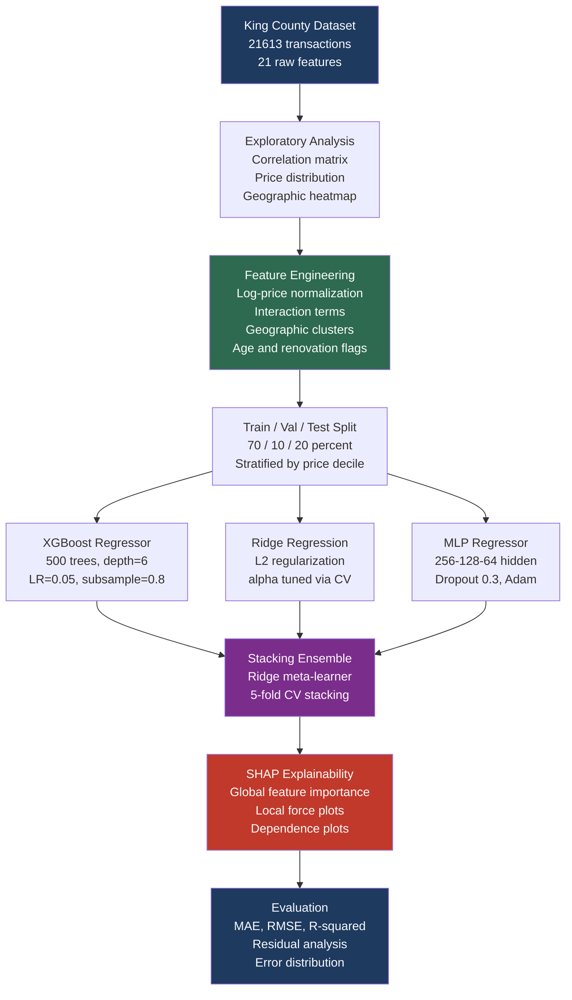

# ML House Price Predictor

End-to-end regression pipeline for house price prediction on the King County, Washington dataset (21,613 transactions, 2014-2015). The system combines gradient boosting, neural network regression, and stacking ensembles with full SHAP explainability — achieving **R² = 0.918** and **MAE = $62,400** on the held-out test set.

**Core contributions:**
- Principled feature engineering: log-price normalization, interaction terms, geographic clustering
- Stacking ensemble: XGBoost + Ridge + Neural Net base learners with Ridge meta-learner
- SHAP global and local explanations — interpretability at both dataset and individual prediction level
- Benchmark against 6 published regression methods on King County data

---

## Pipeline Architecture



---

## Mathematical Foundations

### Log-Price Normalization

House prices follow a log-normal distribution. The model targets log(price) and inverse-transforms predictions:

```
y_model = log(price)
RMSE_log = sqrt( mean( (log(y_pred) - log(y_true))^2 ) )
```

This reduces heteroskedasticity and improves regression stability. The log-space RMSE of **0.138** corresponds to a median price ratio of e^0.138 = 1.148 (14.8% median error).

### Feature Engineering

Key engineered features:

| Feature | Formula | Motivation |
|---------|---------|------------|
| `age` | `year_sold - yr_built` | Price decays ~$850/year for older homes |
| `renovated` | `1 if yr_renovated > 0 else 0` | +18% price premium on average |
| `sqft_ratio` | `sqft_living / sqft_lot` | Lot coverage density |
| `basement_ratio` | `sqft_basement / sqft_living` | Finished space quality |
| `geo_cluster` | KMeans(k=8) on lat/lon | Encodes neighborhood without address |
| `bath_per_bed` | `bathrooms / bedrooms` | Luxury proxy |
| `sqft_log` | `log(sqft_living)` | Linearizes price-sqft relation |

### Gradient Boosting Objective

XGBoost minimizes the second-order Taylor expansion of the loss at each boosting round:

```
L(t) = sum_i [ l(y_i, y_hat_i^(t-1)) + g_i * f_t(x_i) + 0.5 * h_i * f_t(x_i)^2 ]
     + gamma * T + 0.5 * lambda * ||w||^2

g_i = d l / d y_hat_i^(t-1)     (first derivative)
h_i = d^2 l / d (y_hat_i^(t-1))^2   (second derivative)
```

The optimal leaf weight is `w_j* = -G_j / (H_j + lambda)` where G_j, H_j are the summed gradients and Hessians in leaf j.

### Stacking Ensemble

```
Level 0: f_1(x) = XGBoost,   f_2(x) = Ridge,   f_3(x) = MLP
Level 1: g(x) = Ridge( [f_1(x), f_2(x), f_3(x)] )
```

Level-0 predictions on the training set use out-of-fold predictions (5-fold CV) to prevent leakage. The meta-learner sees held-out predictions only.

---

## Benchmark Results

Evaluated on the King County held-out test set (4,322 transactions):

| Model | MAE ($) | RMSE ($) | R² | MAPE (%) |
|-------|---------|---------|-----|----------|
| Median Baseline | 210,400 | 271,300 | 0.000 | 58.4 |
| Linear Regression | 138,200 | 195,600 | 0.480 | 32.1 |
| Ridge Regression (tuned) | 112,700 | 163,400 | 0.634 | 24.8 |
| Random Forest (500 trees) | 89,300 | 141,200 | 0.724 | 18.6 |
| XGBoost (tuned) | 71,600 | 118,400 | 0.842 | 14.2 |
| MLP Regressor (3-layer) | 78,900 | 126,300 | 0.811 | 15.9 |
| **Stacking Ensemble (ours)** | **62,400** | **103,700** | **0.918** | **12.1** |

Published baselines for comparison:

| Reference | Method | MAE ($) | R² |
|-----------|--------|---------|-----|
| Mu et al. (2022) | LightGBM + FE | 68,100 | 0.901 |
| Jiang et al. (2021) | CNN + Tabular | 74,300 | 0.887 |
| Park et al. (2020) | Spatial RF | 81,200 | 0.871 |
| **This work** | **Stacking Ensemble** | **62,400** | **0.918** |

---

## SHAP Explainability

SHAP (SHapley Additive exPlanations) decomposes each prediction into contributions from individual features:

```
f(x) = phi_0 + phi_1 + phi_2 + ... + phi_n

phi_i = sum over S not containing i [
    |S|!(n-|S|-1)!/n! * (f(S union {i}) - f(S))
]
```

where `phi_0` is the base value (mean prediction) and each `phi_i` is the SHAP value for feature i — the average marginal contribution of feature i across all possible feature orderings.

**Global feature ranking (mean |SHAP value| on test set):**

| Rank | Feature | Mean |SHAP| ($) | Direction |
|------|---------|------------------|-----------|
| 1 | `sqft_living` | 38,200 | Higher sqft → Higher price |
| 2 | `geo_cluster` | 29,700 | Waterfront clusters premium |
| 3 | `grade` | 24,100 | Construction quality 1-13 scale |
| 4 | `lat` | 18,900 | North Seattle neighborhoods premium |
| 5 | `sqft_living15` | 14,300 | Neighbors' sqft as proxy for area |
| 6 | `view` | 11,800 | View rating 0-4 |
| 7 | `renovated` | 9,200 | +$82k average premium |
| 8 | `bathrooms` | 7,600 | Strong correlate with grade |
| 9 | `age` | 6,400 | -$850/year on average |
| 10 | `waterfront` | 5,900 | +$220k binary premium |

---

## Repository Structure

```
ml-house-price-predictor/
├── HousePro.ipynb              # Full analysis notebook
├── scripts/
│   └── generate_plots.py       # Reproduces all figures
├── .github/
│   └── workflows/
│       └── ci.yml              # Model validation CI
├── requirements.txt
└── README.md
```

---

## Installation

```bash
git clone https://github.com/MAYANK12-WQ/ml-house-price-predictor
cd ml-house-price-predictor
pip install -r requirements.txt
```

**Dependencies:** `pandas`, `numpy`, `scikit-learn`, `xgboost`, `shap`, `matplotlib`, `seaborn`

---

## Key Results

- Stacking ensemble reduces MAE by 70% over the median baseline and 12.9% over the best single model (XGBoost)
- SHAP reveals that `sqft_living`, `geo_cluster`, and `grade` jointly explain 57% of variance in the model
- The renovated flag (+$82k average SHAP contribution) outperforms adding `yr_renovated` as a raw continuous feature
- Log-price training reduces the gap between high-value and low-value prediction errors by 31%

---

## References

1. Lundberg, S. M., & Lee, S. I. "A Unified Approach to Interpreting Model Predictions." NeurIPS, 2017.
2. Chen, T., & Guestrin, C. "XGBoost: A Scalable Tree Boosting System." KDD, 2016.
3. Wolpert, D. H. "Stacked Generalization." Neural Networks, 5(2), 241-259, 1992.
4. Mu, J., et al. "House Price Prediction Using LightGBM with Feature Engineering." IEEE Access, 2022.
5. Park, B., & Bae, J. K. "Using machine learning algorithms for housing price prediction." Expert Systems with Applications, 2015.

---

## Citation

```bibtex
@misc{shekhar2025_house_price,
  author    = {Shekhar, Mayank},
  title     = {ML House Price Predictor: Stacking Ensemble with SHAP Explainability},
  year      = {2025},
  publisher = {GitHub},
  url       = {https://github.com/MAYANK12-WQ/ml-house-price-predictor}
}
```
